# MarkMatch

**Marks a class of short answers the way *you* mark, and shows the line behind every mark.**

A teacher marks six answers. MarkMatch learns her pattern from those six, she approves what it learned, and then it marks the rest of the class. Every mark it gives must quote the words in the student's answer that earned it, and fixed rules in code throw out any mark whose quote is not really there. Nothing is final until the teacher approves.

**Live:** https://aihack-mrdu-2026-19.vercel.app/app &nbsp;·&nbsp; Built at **AI HACK × MRDU 2K26** (Agentic AI track) &nbsp;·&nbsp; Next.js 16 · TypeScript · Vercel AI SDK 7 · Gemini + Groq (free tiers)

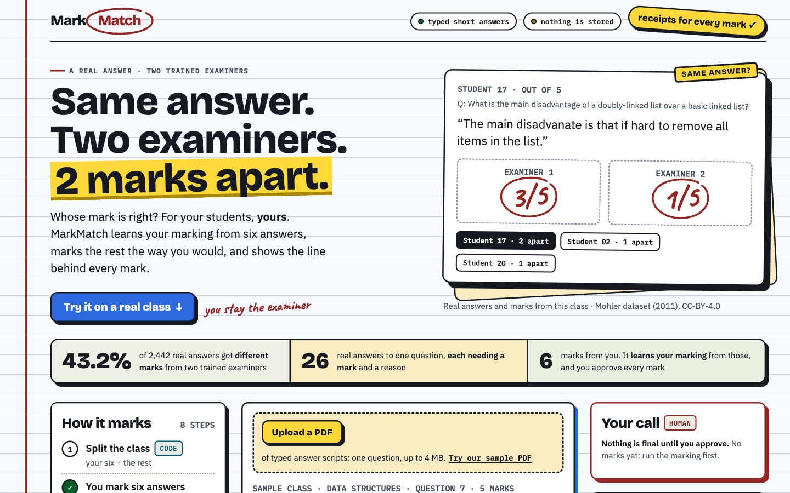

---

## Contents
1. [The problem](#1-the-problem)
2. [What it does](#2-what-it-does)
3. [Screens](#3-screens)
4. [How it works](#4-how-it-works)
5. [The checks the model cannot overrule](#5-the-checks-the-model-cannot-overrule)
6. [Measured results](#6-measured-results)
7. [Repository map: what every file does](#7-repository-map-what-every-file-does)
8. [API](#8-api)
9. [Run it yourself](#9-run-it-yourself)
10. [Limits and honesty notes](#10-limits-and-honesty-notes)
11. [Credits and licences](#11-credits-and-licences)

---

## 1. The problem

Marking short written answers is slow, and it is not consistent even between trained people. In the Mohler short-answer dataset, two examiners marked the same 2,442 student answers. They gave **different marks to 43.2 %** of them, and the same mark to only 56.8 % (we counted this from the dataset).

So a marking tool should not invent its own idea of a "correct" mark. It should copy **this teacher's** marking, show its evidence, and leave the final call to her.

## 2. What it does

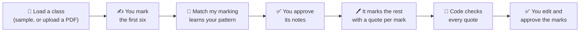

1. **Load a class.** The page opens with a real sample class: 26 real student answers to one data-structures question. Or press **Upload a PDF** with typed answer scripts, and it pulls the question and every student's answer out of the PDF.
2. **Mark six.** You type your own marks for the first six answers.
3. **Match my marking.** The tool marks those six, counts how many match you, writes "scheme notes" that explain your marking (for example *"Give 3 points when the answer says insertion or deletion is harder"*), and tries again. It runs at most 2 rounds, and code keeps a round only if it matches you more.
4. **Approve the notes.** You can read, edit or delete every note before it is used.
5. **Mark the rest.** Each mark comes with the quoted line that earned it, highlighted in the answer.
6. **Checks.** Fixed rules confirm each quote is really in the answer and the marks add up. A failed mark is re-asked once; if it fails again, the answer comes to you unmarked.
7. **Approve.** You change any mark (it is tagged "EDITED BY YOU") and approve. Marks stay in your browser tab; nothing is stored on a server.

**Break it** (a checkbox, ticked by default) deliberately plants a false quote in one mark, so you can watch the check catch it and the tool fix it on the second try.

## 3. Screens

| | |
|---|---|
| 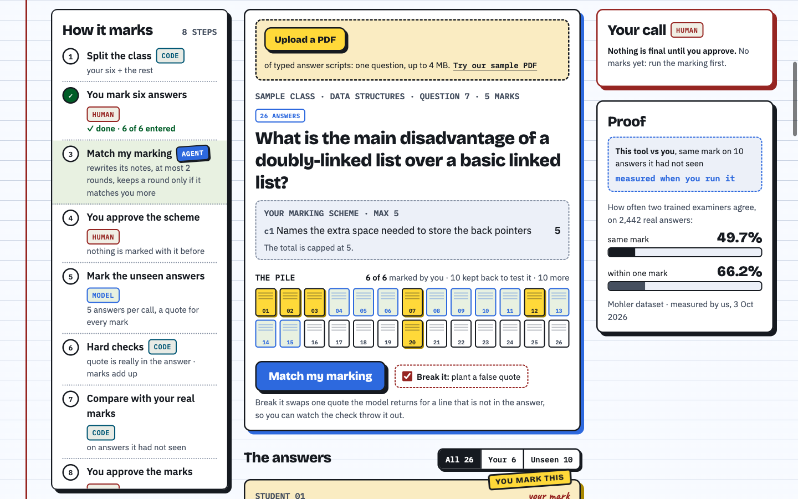 **The workspace.** Left: every step with its role badge (CODE, MODEL, AGENT, HUMAN). Middle: the question, the scheme, the pile of scripts and the upload box. Right: your approval and the proof. | 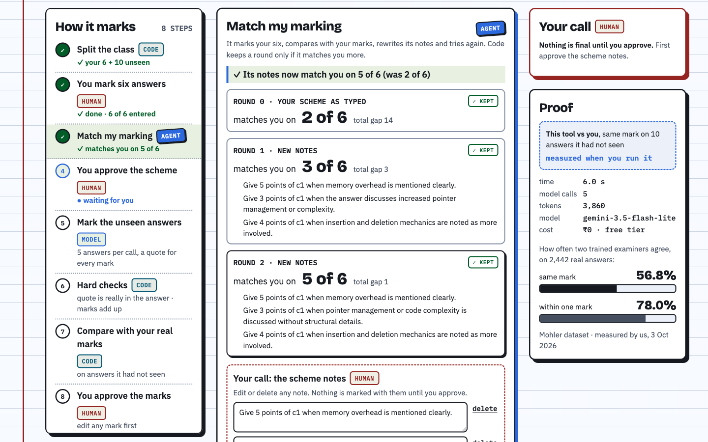 **Match my marking.** Round 0 uses your scheme as typed; each new round shows its notes and whether code kept it. You approve the notes before they are used. |
| 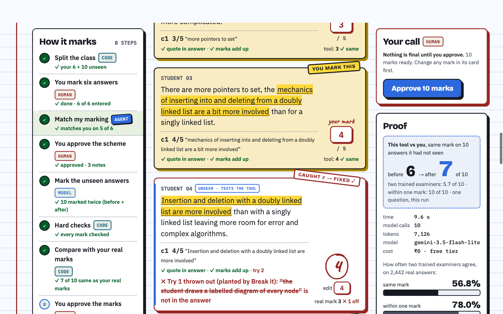 **Checked marks.** The quoted words are highlighted in each answer. The red card is Break it: the planted quote was thrown out on try 1 and fixed on try 2. "real mark 3 ✗ 1 off" shows an honest miss. | 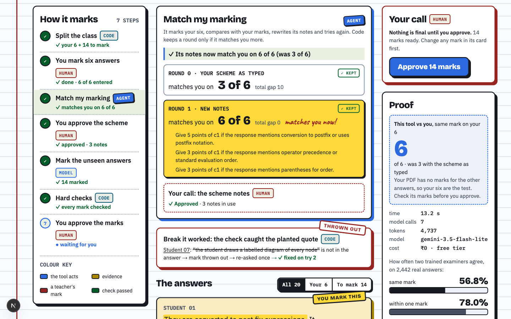 **An uploaded PDF.** 20 answers read from a PDF; the notes took the match on the teacher's six from 3 to 6 of 6, and the other 14 were marked with them. |

<p align="center">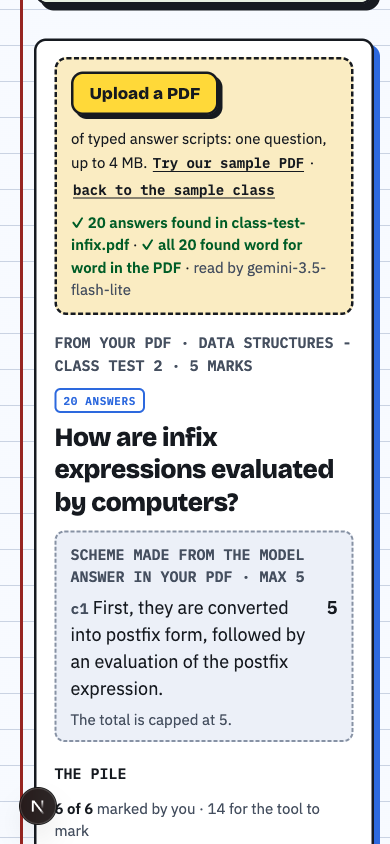<br/><em>Works at phone width (390 px).</em></p>

## 4. How it works

### 4.1 The parts

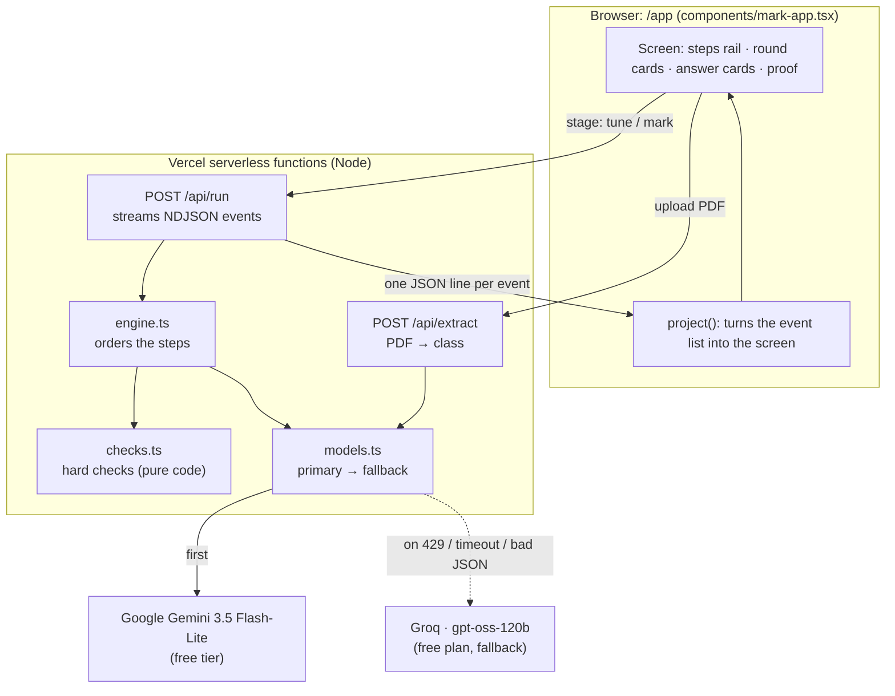

There is **no database and no login**. The API keys live only on the server. The browser holds the class and your marks for as long as the tab is open.

### 4.2 Who does each step

Every step on screen carries one of these badges, so you can see that only one step is an "agent" and the checks are plain code.

| Badge | Meaning | Steps |
|---|---|---|
| **CODE** | A plain function; same input, same output | split the class, hard checks, count matches, keep-or-drop a round, compare with real marks |
| **TOOL** | A library call, no AI | read the text out of a PDF (`unpdf`) |
| **MODEL** | One structured call to a language model, answer validated against a schema | mark a batch of up to 5 answers; read a PDF into question + answers |
| **AGENT** | Looks at its own results, changes its approach, tries again, within limits | Match my marking (≤ 2 rounds, kept only if matches rise) |
| **HUMAN** | The teacher decides | mark the six, approve the notes, edit and approve the marks |

### 4.3 One run, step by step

The run is **two requests**, because the teacher approves the notes in between.

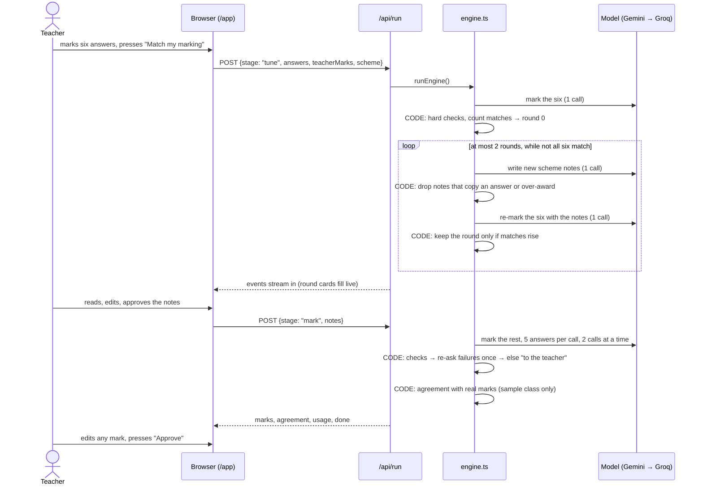

### 4.4 Match my marking (the agent step)

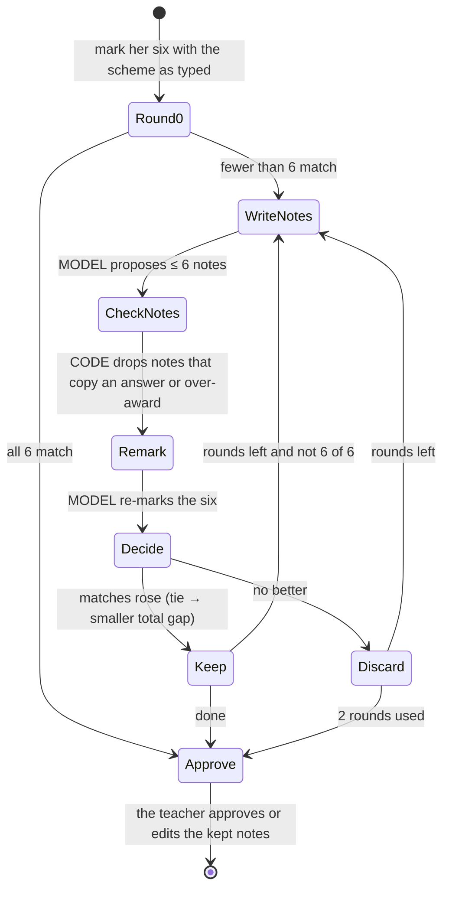

### 4.5 Upload a PDF

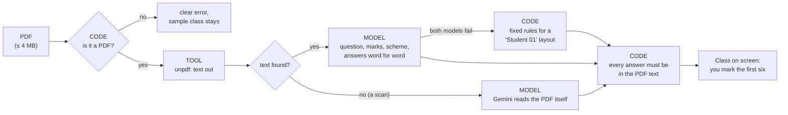

If the PDF has no marking scheme, the scheme becomes one criterion made from the PDF's model answer (or from the question). An answer that is not found word for word in the PDF gets a red tag on its card.

### 4.6 When something fails

| What fails | What happens |
|---|---|
| Gemini is rate-limited, slow (> 25 s) or returns bad JSON | That call goes to Groq once; the proof box shows "fallback used" |
| Both providers fail on a batch | Those answers come to the teacher unmarked; the run continues |
| The whole run fails | A red "The run stopped" card with "Try again" |
| A quote is not in the answer | The mark is thrown out on screen, re-asked once, then sent to the teacher |
| The PDF has no readable answers | A clear error; the sample class stays loaded |

## 5. The checks the model cannot overrule

All in [`web/lib/checks.ts`](web/lib/checks.ts), pure functions with no AI:

1. **The quote is really in the answer.** Every mark above 0 needs a quote that appears in the student's answer, ignoring case, spacing and punctuation, and matching whole words.
2. **The marks add up.** Each criterion gets a whole number from 0 to its points, every criterion is marked exactly once, and the total is capped at the question's maximum.
3. **Notes may not copy a student.** A scheme note that shares 6 or more consecutive words with any of the six answers is dropped. A note that gives more points than a criterion is worth ("4 points of c2" when c2 is worth 3) is dropped too.
4. **A round is kept only if it is better.** More exact matches with the teacher, or the same number with a smaller total gap.

## 6. Measured results

Real runs, real model, small samples. These are what we saw, not claims about every class.

| When (3 Oct 2026) | Class | What we measured | Result |
|---|---|---|---|
| 21:45 · CLI run | Sample (Mohler Q E07.Q07), her six | matches before → after Match my marking | **2 → 5 of 6** |
| 21:45 · CLI run | same, 10 answers it had not seen | same mark as the real grader, scheme as typed → with notes | **6 → 8 of 10** |
| 22:07 · live site | same | her six · unseen 10 · time | 2 → 5 of 6 · **6 → 7 of 10** · 9.6 s, 10 model calls, ₹0 |
| 21:55 · live site | Uploaded PDF (Mohler Q E08.Q06, 20 answers) | answers found word for word · her six | **20 of 20** in 5 s · **3 → 6 of 6** |
| 21:55 · checked offline | same PDF, the other 14 | same mark as the real grader (marks were not in the PDF) | **11 of 14** exact, 12 of 14 within one |
| every run | Break it | planted quote caught and fixed | caught every time we ran it |

For comparison, the two human examiners in the dataset agreed exactly on 56.8 % of answers (5.7 of 10). Runs differ a little from one to the next, because a language model is not fully deterministic.

## 7. Repository map: what every file does

```
.
├── README.md                      ← you are here
├── docs/images/                   screenshots used in this README
└── web/                           the whole product (one Next.js app)
    ├── app/
    │   ├── layout.tsx             fonts, page title, <html> shell
    │   ├── globals.css            the visual style: ruled paper, ink outlines, stamps, highlighter
    │   ├── page.tsx               "/" (redirected to /app; reserved for a future landing page)
    │   ├── app/page.tsx           "/app": renders <MarkApp/>
    │   └── api/
    │       ├── run/route.ts       POST /api/run: validates the request, streams engine events as NDJSON
    │       └── extract/route.ts   POST /api/extract: takes a PDF, returns the class found in it
    ├── components/
    │   ├── mark-app.tsx           the whole /app screen: upload, your six, steps rail, rounds, answers, approval, proof
    │   ├── hero.tsx               the top section: one real answer, two examiners' marks
    │   └── pen.tsx                small effects: red-pen circle, count-up numbers, reveal on scroll
    ├── lib/
    │   ├── types.ts               the contracts (Zod): request, events, model output shapes
    │   ├── engine.ts              the run engine: split → mark six → Match my marking → mark the rest → agreement
    │   ├── checks.ts              the hard checks (section 5) and the match counting
    │   ├── models.ts              calls Gemini, falls back to Groq once; 25 s timeout; PDF-file call for scans
    │   ├── extract.ts             PDF → class: unpdf text, one model call, word-for-word check, rules fallback
    │   ├── project.ts             turns the event list into what the screen shows; reads the NDJSON stream
    │   ├── mock.ts                canned model answers for building offline (CREW_MOCK=1, never in production)
    │   ├── flags.ts               feature switches (Match my marking on/off, etc.)
    │   └── demo/
    │       ├── sample.ts          the sample class, which six you mark, and the request builder for any class
    │       └── mohler_sample.json 5 real questions, 141 real answers, two real graders' marks (Mohler, CC-BY-4.0)
    ├── design/
    │   ├── tokens.css             colour, type and spacing variables (the only source of colours)
    │   └── tokens.json            the same tokens as data
    ├── public/samples/
    │   └── class-test-infix.pdf   a sample answer-script PDF (20 real answers) for "Try our sample PDF"
    ├── scripts/
    │   ├── keytest.mts            checks both API keys with one structured call each
    │   ├── run.mts                runs a full hero run in the terminal and prints every event
    │   └── extract.mts            reads a PDF in the terminal and prints what it found
    ├── .env.example               the environment variable NAMES (no values)
    ├── next.config.ts             redirects "/" to "/app"
    ├── package.json               dependencies and npm scripts
    └── eslint.config.mjs, postcss.config.mjs, tsconfig.json   lint, CSS and TypeScript settings
```

## 8. API

### `POST /api/run` → `application/x-ndjson`

Request (validated by `RunRequest` in [`web/lib/types.ts`](web/lib/types.ts)):

```jsonc
{
  "stage": "tune",                       // "tune" = mark her six + Match my marking; "mark" = mark the rest
  "question": "What is the main disadvantage of a doubly-linked list over a basic linked list?",
  "maxMarks": 5,
  "scheme": [{ "id": "c1", "text": "Names the extra space needed to store the back pointers", "points": 5 }],
  "answers": [{ "id": "E07.Q07.A00", "text": "they take up twice as much memory for each node" }],
  "teacherMarks": [{ "answerId": "E07.Q07.A00", "mark": 5 }],
  "heldOutMarks": [],                    // real marks for unseen answers (sample class only), used for agreement
  "notes": [],                           // the approved notes (stage "mark")
  "breakIt": true,                       // plant one false quote to show the check
  "matchEnabled": true
}
```

The response is one JSON object per line, each sent the moment it happens:

| Event | When | Key fields |
|---|---|---|
| `step` | a step starts or ends | `id`, `role` (CODE/MODEL/AGENT/HUMAN), `label`, `status` |
| `round` | a Match my marking round ends | `n`, `matches`, `of`, `gap`, `notes`, `dropped`, `kept` |
| `mark` | an answer passes the checks | `phase` (six/before/after), `mark` {criteria with quotes, total, attempt} |
| `rejected` | a mark fails a check | `answerId`, `quote`, `reason`, `attempt`, `final`, `planted` |
| `scheme` | end of stage "tune" | the notes to approve, `matches`, `of` |
| `agreement` | sample class only | `phase`, `exact`, `withinOne`, `n` |
| `usage` | end of each stage | `calls`, tokens, `seconds`, `model`, `usedFallback` |
| `error` | the run failed | `message` |
| `done` | always last | — |

### `POST /api/extract` (multipart, field `file`) → JSON

Returns `{ cls: { title, question, maxMarks, scheme, schemeFrom, answers: [{ label, text, inPdf }] }, pages, how, model, usedFallback }`, or `{ error }` with status 400 / 413 / 422.

## 9. Run it yourself

Needs **Node 22+** and two free API keys: [Google AI Studio](https://aistudio.google.com/) (Gemini) and [Groq](https://console.groq.com/).

```bash
cd web
npm ci
cp .env.example .env.local    # then type your two keys into .env.local
npm run dev                   # http://localhost:3000/app
```

| Variable | What it is |
|---|---|
| `GOOGLE_GENERATIVE_AI_API_KEY` | Gemini key (primary model) |
| `GROQ_API_KEY` | Groq key (fallback model) |
| `MODEL_PRIMARY` | Gemini model id, default `gemini-3.5-flash-lite` |
| `MODEL_FALLBACK` | Groq model id, default `openai/gpt-oss-120b` |
| `NEXT_PUBLIC_MATCH_ENABLED` | `0` turns Match my marking off (the tool then just marks with your scheme) |
| `CREW_MOCK` | `1` = canned model answers, for working offline. Local only |

Useful commands (run inside `web/`):

```bash
npx tsx --env-file=.env.local scripts/keytest.mts            # do both keys work?
npx tsx --env-file=.env.local scripts/run.mts --break        # a full run in the terminal
CREW_MOCK=1 npx tsx scripts/run.mts --break                  # the same, with no keys
npx tsx --env-file=.env.local scripts/extract.mts public/samples/class-test-infix.pdf
npm run build && npm run lint
```

**Deploy:** Vercel, project root `web/`, with the same variables set in the Vercel project (never `CREW_MOCK`). The run route allows up to 120 s.

## 10. Limits and honesty notes

- **Typed answers, one question per PDF.** A scanned PDF goes to Gemini directly, with no second model behind it; this path is untested.
- **The sample data is public and from 2011** (a US data-structures course). A public dataset may be in a model's training data. That is one reason the upload feature exists: try it on your own answers.
- **Small numbers.** The results in section 6 come from one question and a handful of runs. They show the mechanism working; they are not a benchmark.
- **Free tiers.** Gemini's free quota can run out after a few runs in quick succession; Groq then takes over automatically. Free-tier providers may use the text they receive to improve their models, so don't upload real students' names.
- **Uploaded classes have no before/after number**, because the PDF has no real marks to compare with. Your six are the test.
- **Not built:** login, saving marks, handwriting recognition, plagiarism checks, analytics.

## 11. Credits and licences

- **Student answers and marks:** Mohler, Bunescu and Mihalcea (2011), *Learning to grade short answer questions using semantic similarity measures and dependency graph alignments*; [Mohler ASAG dataset](https://huggingface.co/datasets/nkazi/MohlerASAG), CC-BY-4.0. Used in `web/lib/demo/mohler_sample.json` and the sample PDF.
- **Fonts** (SIL Open Font License 1.1, via `next/font`): Bricolage Grotesque (Mathieu Triay), IBM Plex Sans and IBM Plex Mono (IBM), Caveat (Impallari Type).
- **Libraries:** Next.js, React, Vercel AI SDK, Zod, unpdf, Tailwind CSS.
- Built during **AI HACK × MRDU 2K26** (3–4 Oct 2026) from an empty Next.js scaffold. AI coding assistants were used, as the event allows.
